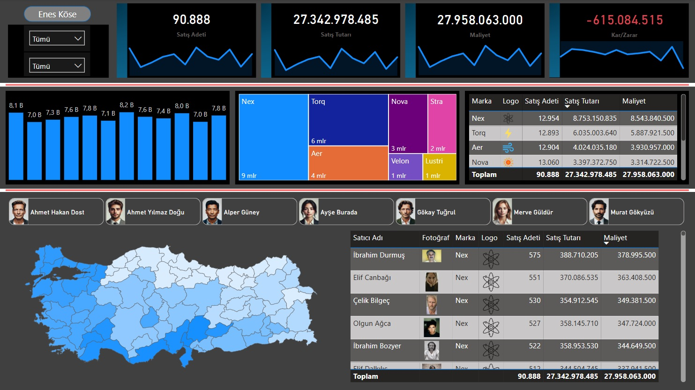

# Data Analyst

#### Technical Skills: SQL, Power BI, Looker (LookML), Excel, Git, Python, (Pandas, NumPy), C# (.NET), Java, HTML5, CSS3, PHP

## Education
- Associate Degree, Computer Programming | Firat University (_June 2022 - July 2024_)

## Work Experience
**Software Support Intern @ LojiPlatform (_May 2023 - October 2023_)**
- After receiving approximately 5 hours of training on Odoo back-end development processes, I designed and developed customized Odoo modules using **Python**, **XML**, and **CSV**
- I gained knowledge on professional **website design principles** and **user experience-focused design** processes, contributing to **workflows** in this area
- I actively participated in meetings focused on **work ethics**, **team communication**, and **data organization** strategies using **Excel**
- During the internship, I gained comprehensive experience on how software development processes are carried out in a professional environment

## Projects
### Sales Analysis Dashboard (Power BI)
[Github](https://github.com/enskose/Power-BI-Analysis/tree/main)

- In this project, I’m excited to share my hands-on journey through a sales data analysis using Power BI. The report walks you through my process—from gathering and cleaning data, to modeling it with some neat DAX formulas, and finally, creating an interactive dashboard that brings the numbers to life.

**What I Did:**

> Data Collection and Preparation:
> **I started by collecting sales data from various sources and then spent some time cleaning and transforming it. This ensured I was working with reliable information right from the start.**

> Data Modeling and DAX Usage: 
> **I built a comprehensive data model that ties everything together. To extract deeper insights, I utilized DAX formulas like CALCULATE and FILTER. These formulas helped me perform dynamic calculations under different scenarios and truly understand the performance trends.**

> Visualization and Dashboard Design:
> **Using Power BI, I created an interactive, user-friendly dashboard. This tool visually presents sales trends, regional distributions, and key performance metrics in a clear and engaging way. Along the journey, I also leveraged some Excel techniques for data prep to ensure everything was in tip-top shape.**

> Impact on Business Processes:
> **Beyond just crunching numbers, this report is all about how data-driven decision making can transform business processes. It’s a practical demonstration of how using the right tools and methods can lead to smarter, more informed strategies.**

- This report reflects my analytical approach, the technology I used, and my problem-solving skills. I hope that as you explore this project, you get a genuine feel for how I work with data to create actionable insights and add value to business strategies.

